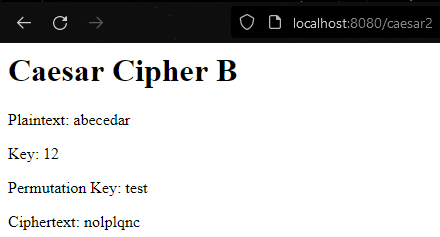

# Laboratory Work 5: Web Authentication & Authorisation

# Web Server 

To make a web server in java, the com.sun.net.httpserver package was used. The package provides
a simple HTTP server API, which is used to build embedded HTTP servers.

To create the server, simply create a new HttpServer and use the create() method to create a new
HTTP server instance. The server is then bound to a specific port and started. The server is
then ready to accept incoming requests.

```java
HttpServer server = HttpServer.create(new InetSocketAddress(8080), 0);
server.start();
```

To handle incoming requests, a new class that extends the HttpHandler interface must be created.
The HttpHandler interface has a single method, handle(), which is called when a request is
received. The handle() method takes a HttpExchange object as a parameter, which contains the
request and response information.

```java
public class MyHandler implements HttpHandler {
    @Override
    public void handle(HttpExchange exchange) throws IOException {
        // Handle request
    }
}
```

To handle requests, the server must be told which handler to use for each request. This is done
by creating a new HttpContext object and passing the handler to the createContext() method.

```java
HttpContext context = server.createContext("/mycontext", new MyHandler());
```

## Preparation for User Authentication

### 2FA

First the dependency for the 2FA library was added to the pom.xml file.

```xml
<dependency>
    <groupId>de.taimos</groupId>
    <artifactId>totp</artifactId>
    <version>1.0</version>
</dependency>
```

To implement 2FA, the Google Authenticator app was used. The app generates a 6-digit code that
changes every 30 seconds. The code is generated using a secret key, which is shared between
the app and the server. In general, the secret key is stored as a field inside the database for
each user. But for this laboratory work, only one secret key was generated for every user for simplicity.

Generating a secret key is done using the generateSecretKey() method from TwoFA class:

```java
public static String generateSecretKey() {
        SecureRandom random = new SecureRandom();
        byte[] bytes = new byte[20];
        random.nextBytes(bytes);
        Base32 base32 = new Base32();
        return base32.encodeToString(bytes);
}
```

The generated secret key is then used inside the Google Authenticator app to generate a 6-digit.

The 6-digit code generated inside Google Authenticator app can be checked by calling the getTOTPCode()

```java
public static String getTOTPCode(String secretKey) {
        Base32 base32 = new Base32();
        byte[] bytes = base32.decode(secretKey);
        String hexKey = Hex.encodeHexString(bytes);
        return TOTP.getOTP(hexKey);
}
```

### Database

A simple database implementation was used (which was done in Laboratory work 4).
The database contains a list of users, each with a username and password. The database is
stored in a HashMap, where the username is the key and the password is the value.

Only a slight modification was made to the database. A new function was added that will
check and authenticate the user if the username and the hashed password are correct.

```java
public static boolean authenticate(String username, String password) throws NoSuchAlgorithmException {
        Database temp = getDataById(username);
        if(temp != null){
            byte[] hashedPassword = MessageDigest.getInstance("SHA-256").digest(password.getBytes(StandardCharsets.UTF_8));
            if(DatatypeConverter.printHexBinary(hashedPassword).equals(getDataById(username).getPassword())){
                return true;
            } else {
                return false;
            }
        } else {
            return false;
        }
    }
```

## User Authentication

### Login

The login page accessed when entering the path "/login". The page contains a form
with three input fields: username, password and 2FA code. The submit button will send a POST
request to the "/login" path. The login page is shown below:


Everything seen in the image is loaded inside the handle() method of the logIn class.
 ```java
 public static class logIn implements HttpHandler {
    @Override
    public void handle(HttpExchange exchange) throws IOException {
        if (!sessionLoggedIn) {
            byte[] response = ("<html><body><form action=\"/login\" method=\"post\">"
                    + "Username: <input type=\"text\" name=\"username\"><br>"
                    + "Password: <input type=\"password\" name=\"password\"><br>"
                    + "2FA Code: <input type=\"text\" name=\"2fa\"><br>"
                    + "<input type=\"submit\" value=\"Submit\">"
                    + "</form></body></html>").getBytes(StandardCharsets.UTF_8);

            if (exchange.getRequestMethod().equalsIgnoreCase("POST")) {
                String[] input = new BufferedReader(new InputStreamReader(exchange.getRequestBody()))
                        .lines().collect(Collectors.joining("\n")).split("&");

                String username = input[0].split("=")[1];
                String password = input[1].split("=")[1];
                String twoFACode = input[2].split("=")[1];

                System.out.println("Username: " + username + ", Password: " + password + ", 2FA Code: " + twoFACode);

                try {
                    if (Database.authenticate(username, password)) {
                        if (getTOTPCode(secretKey).equals(twoFACode)) {
                            sessionLoggedIn = true;
                            response = ("<html><body><h1>Logged in!</h1></body></html>").getBytes(StandardCharsets.UTF_8);
                        } else {
                            response = ("<html><body><h1>2FA code is incorrect!</h1></body></html>").getBytes(StandardCharsets.UTF_8);
                        }
                    } else {
                        response = ("<html><body><h1>Username or password is incorrect!</h1></body></html>").getBytes(StandardCharsets.UTF_8);
                    }
                } catch (NoSuchAlgorithmException e) {
                    e.printStackTrace();
                }
            }
            exchange.sendResponseHeaders(200, response.length);
            OutputStream os = exchange.getResponseBody();
            os.write(response);
            os.close();
        } else {
            byte[] response = ("<html><body><h1>Already logged in!</h1></body></html>").getBytes(StandardCharsets.UTF_8);
            exchange.sendResponseHeaders(200, response.length);
            OutputStream os = exchange.getResponseBody();
            os.write(response);
            os.close();
        }
    }
}
 ```

#### Breaking the log-in down

The function is first checking if the user is logging. Based on the session variable, the user
will either receive the log-in form or a message saying that the user is already logged in.

The response variable stores the HTML code that will be sent to the user. The HTML code is
created using a string and the getBytes() method. The getBytes() method is used to convert the
string to a byte array, which is then sent to the user using the OutputStream class by calling the os.write() function.

```java
//The response the user receives on entering the page if not logged in
byte[] response = ("<html><body><form action=\"/login\" method=\"post\">"
                    + "Username: <input type=\"text\" name=\"username\"><br>"
                    + "Password: <input type=\"password\" name=\"password\"><br>"
                    + "2FA Code: <input type=\"text\" name=\"2fa\"><br>"
                    + "<input type=\"submit\" value=\"Submit\">"
                    + "</form></body></html>").getBytes(StandardCharsets.UTF_8);
```

```java 
//The response the user receives on entering the page if logged in
byte[] response = ("<html><body><h1>Already logged in!</h1></body></html>").getBytes(StandardCharsets.UTF_8);
```

As said above, the submit button will send a POST request to the "/login" path. The POST request
body will contain the username, password and 2FA code. The POST request body is received using
the BufferedReader class. The BufferedReader class is used to read the POST request body and
the lines() method is used to read the POST request body line by line. The lines() method
returns a Stream object, which is then converted to a string using the Collectors.joining()
method. The string is then split by the "&" character, which will split the string into three
parts: username, password and 2FA code. Then the string is split by the "=" character, which
will split the string into two parts: the key and the value. The key is then ignored and the
value is stored in a variable.

```java
String[] input = new BufferedReader(new InputStreamReader(exchange.getRequestBody()))
                       .lines().collect(Collectors.joining("\n")).split("&");

String username = input[0].split("=")[1];
String password = input[1].split("=")[1];
String twoFACode = input[2].split("=")[1];
```

Based on the variables, the authentication process is started. The authenticate() method is
called and the username and password variables are passed as parameters. The authenticate()
method will return true if the username and password are correct and false if they are not.

If the username and password are correct, the 2FA code is checked. The getTOTPCode() method is
called and the secretKey variable is passed as a parameter. The getTOTPCode() method will
return the 2FA code based on the secretKey variable. The 2FA code is then compared to the
twoFACode variable. If the 2FA code is correct, the sessionLoggedIn variable is set to true and
the user is logged in. If the 2FA code is incorrect, the user is not logged in and a message is
shown.

```java
if (Database.authenticate(username, password)) {
    if (getTOTPCode(secretKey).equals(twoFACode)) {
        sessionLoggedIn = true;
        response = ("<html><body><h1>Logged in!</h1></body></html>").getBytes(StandardCharsets.UTF_8);
    } else {
        response = ("<html><body><h1>2FA code is incorrect!</h1></body></html>").getBytes(StandardCharsets.UTF_8);
    }
} else {
    response = ("<html><body><h1>Username or password is incorrect!</h1></body></html>").getBytes(StandardCharsets.UTF_8);
}
```

### Logging out

The logout page is accessed when entering the "/logout" path. The logout page is only
accessible when the user is logged in. The logout page will set the sessionLoggedIn variable to
false and the user will be logged out.

```java
public static class logOut implements HttpHandler {
        @Override
        public void handle(HttpExchange exchange) throws IOException {
            if(sessionLoggedIn){
                byte[] response = ("<html><body><h1>You have been logged out!</h1></body></html>").getBytes(StandardCharsets.UTF_8);
                sessionLoggedIn = false;

                exchange.sendResponseHeaders(200, response.length);
                OutputStream os = exchange.getResponseBody();
                os.write(response);
                os.close();

            } else {
                byte[] response =  ("<html><body><h1>You are not logged in!</h1></body></html>").getBytes(StandardCharsets.UTF_8);

                exchange.sendResponseHeaders(200, response.length);
                OutputStream os = exchange.getResponseBody();
                os.write(response);
                os.close();
            }
        }
```

## Authorisation

The authorisation process is used to check if the user has the correct permissions to access a
page. The authorisation process is done by checking if the user is logged in and if the user
has the correct permissions. The authorisation process is done by checking the sessionLoggedIn
variable.

If the sessionLoggedIn variable is true, the user has access to the 4 classical cipher pages. Those 4
pages can be accessed by entering the "/caesar1", "/caesar2", "/vigenere", "/playfair" which have similar
looking classes and functions but with slight differences such as the cipher called and what keys are used. If the
sessionLoggedIn variable is false, the user will get a response saying that the user is not logged in.

On entering the page of any cipher, the user will see a form asking for the input text and the keys. 
The input text and the keys will be sent to the server using a POST request. The POST request body will 
contain the input text and the keys. The POST request body is processed the same way
as in the log-in process. The input text and the keys are then passed to the cipher class and the
cipher class will return the encrypted text. The encrypted text is then sent to the user by refreshing the
page and showing the initial message, the encrypted text and the keys.

As said above, if the user will see a form asking for the input text and the keys. For Caesar Cipher A, the
form looks like this:


After entering the input text and the key, the user will click the "Encrypt" button. The user will see this:


The code:

```java
public static class caesarA implements HttpHandler {
        @Override
        public void handle(HttpExchange exchange) throws IOException {
            if (sessionLoggedIn){
                if ("POST".equals(exchange.getRequestMethod())) {
                    String response = new BufferedReader(new InputStreamReader(exchange.getRequestBody()))
                            .lines().collect(Collectors.joining("\n"));
                    String[] responseArray = response.split("&");
                    String plaintext = responseArray[0].split("=")[1];
                    String key = responseArray[1].split("=")[1];
                    int keyInt = Integer.parseInt(key);
                    CaesarCipherA caesarCipherA = new CaesarCipherA(keyInt);
                    String ciphertext = caesarCipherA.encryptMessage(plaintext);
                    String htmlResponse = "<html><body><h1>Caesar Cipher A</h1><p>Plaintext: " + plaintext + "</p><p>Key: " + key + "</p><p>Ciphertext: " + ciphertext + "</p></body></html>";
                    exchange.sendResponseHeaders(200, htmlResponse.length());
                    OutputStream os = exchange.getResponseBody();
                    os.write(htmlResponse.getBytes());
                    os.close();
                } else {
                    String htmlResponse = "<html><body><h1>Caesar Cipher A</h1><form method=\"post\" action=\"/caesar1\"><input type=\"text\" name=\"plaintext\" placeholder=\"Plaintext\"><input type=\"text\" name=\"key\" placeholder=\"Key\"><input type=\"submit\" value=\"Encrypt\"></form></body></html>";
                    exchange.sendResponseHeaders(200, htmlResponse.length());
                    OutputStream os = exchange.getResponseBody();
                    os.write(htmlResponse.getBytes());
                    os.close();
                }
            } else {
                byte[] response = ("<h1>Not logged in</h1>").getBytes(StandardCharsets.UTF_8);
                exchange.sendResponseHeaders(302, response.length);
                OutputStream os = exchange.getResponseBody();
                os.write(response);
                os.close();
            }
        }
    }
```

### Breaking down the code

First step is the verification of the sessionLoggedIn variable. If the sessionLoggedIn variable is
true, the post request body on "Encrypt" button press is processed. The post request body is
processed the same way as in the log-in process. 

```java
String response = new BufferedReader(new InputStreamReader(exchange.getRequestBody()))
                            .lines().collect(Collectors.joining("\n"));
String[] responseArray = response.split("&");
String plaintext = responseArray[0].split("=")[1];
String key = responseArray[1].split("=")[1];
int keyInt = Integer.parseInt(key);
```

The saved variables are then sent to the cipher which will return the encrypted text.

```java
CaesarCipherA caesarCipherA = new CaesarCipherA(keyInt);
String ciphertext = caesarCipherA.encryptMessage(plaintext);
```

The encrypted text is then sent to the user by refreshing the page and showing the initial message,
the encrypted text and the keys.

```java
String htmlResponse = "<html><body><h1>Caesar Cipher A</h1><p>Plaintext: " + plaintext + "</p><p>Key: " + key + "</p><p>Ciphertext: " + ciphertext + "</p></body></html>";
exchange.sendResponseHeaders(200, htmlResponse.length());
OutputStream os = exchange.getResponseBody();
os.write(htmlResponse.getBytes());
os.close();
```
## Showcase of every page and the post request bodies

### Caesar Cipher A

Caesar Cipher A page:


Caesar Cipher B post request body:


### Caesar Cipher B

Caesar Cipher B page:




Caesar Cipher B post request body:


### Playfair Cipher

Playfair Cipher page:


Playfair Cipher post request body:


### Vigenere Cipher

Vigenere Cipher page:


Vigenere Cipher post request body:


#### Log-in page

Log-in page:


Log-in post request body:

